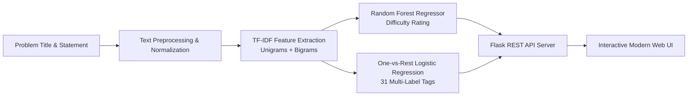

# CPVision-AI 🎯
> **Joint Difficulty Rating and Algorithmic Tag Prediction for Competitive Programming Problems**  
> *Undergraduate Research / Course Project — Department of Computer Science & Engineering*

---

## 📌 Project Overview
**CPVision-AI** is an end-to-end Machine Learning system and interactive web application designed to assist competitive programmers, contest authors, and educators. By analyzing the natural language text of a problem statement (including Title, Statement, Input, and Output specifications), CPVision-AI automatically predicts:
1. **Codeforces Difficulty Rating** (scalar regression: 800 – 3500)
2. **Algorithmic Category Tags** (multi-label classification: 31 classes such as *Dynamic Programming, Graph Theory, DSU, Greedy, Math, Number Theory, etc.*) along with per-tag model confidence scores.

---

## 🏗️ System Architecture & ML Pipeline



### 1. Feature Representation
- **TF-IDF (Term Frequency-Inverse Document Frequency)**:
  - Sublinear term-frequency scaling (`sublinear_tf=True`)
  - Word unigrams and bigrams (`ngram_range=(1, 2)`)
  - Minimum document frequency (`min_df=2`), maximum document frequency (`max_df=0.95`)
  - 20,000 features for Rating estimation & 25,000 features for Tag prediction.

### 2. Machine Learning Models
- **Difficulty Rating Predictor**:
  - Model: `RandomForestRegressor` (150 decision trees, unrestricted depth, square-root feature subsampling).
  - Outputs a calibrated Codeforces rating and maps it to official tier ranks (*Newbie, Pupil, Specialist, Expert, Master, Grandmaster, etc.*).
- **Multi-Label Tag Predictor**:
  - Model: `OneVsRestClassifier(LogisticRegression(C=5, solver='saga', class_weight='balanced'))`.
  - Target: Binary array across 31 filtered algorithmic classes with frequency $\ge 50$.
  - Generates binary tag assignments and calibrated posterior confidence probabilities.

---

## 📊 Dataset Summary
- **Source**: 7,185 Codeforces problems with verified difficulty annotations and community tags.
- **Rating Range**: 800 to 3500 (Mean: 1806.24, Median: 1700, Standard Deviation: 712.83).
- **Supported Algorithmic Tags (31 classes)**:
  `binary search`, `bitmasks`, `brute force`, `combinatorics`, `constructive algorithms`, `data structures`, `dfs and similar`, `divide and conquer`, `dp`, `dsu`, `fft`, `flows`, `games`, `geometry`, `graph matchings`, `graphs`, `greedy`, `hashing`, `implementation`, `interactive`, `math`, `matrices`, `number theory`, `probabilities`, `shortest paths`, `sortings`, `string suffix structures`, `strings`, `ternary search`, `trees`, `two pointers`.

---

## 🚀 How to Run the Project

### Prerequisites
- Python `3.9+` (tested with Python 3.9, 3.10, 3.11)
- `pip` (Python package manager)

---

### Step 1: Clone or Navigate to the Project Directory
```bash
cd /path/to/CPVision-AI
```

### Step 2: Create & Activate a Virtual Environment
- **On macOS / Linux:**
  ```bash
  python3 -m venv .venv
  source .venv/bin/activate
  ```
- **On Windows:**
  ```cmd
  python -m venv .venv
  .venv\Scripts\activate
  ```

### Step 3: Install Dependencies
```bash
pip install -r requirements.txt
```

### Step 4: Launch the Web Application
```bash
python app.py
```
*Or using the production WSGI server:*
```bash
gunicorn app:app --workers 1 --threads 2 --timeout 120 --bind 0.0.0.0:5001
```

### Step 5: Open in Your Web Browser
Open your browser and navigate to:
👉 **[http://127.0.0.1:5001](http://127.0.0.1:5001)**

---

## 🌐 API Reference

### 1. Joint Prediction (Rating + Tags)
- **Endpoint**: `POST /predict-all`
- **Headers**: `Content-Type: application/json`
- **Request Body**:
  ```json
  {
    "title": "Two Sum",
    "statement": "Given an array of n integers, find two elements whose sum equals a target value. Return their indices.",
    "input": "First line contains n and target. Second line contains n integers.",
    "output": "Print two 1-based indices."
  }
  ```
- **Response**:
  ```json
  {
    "rating": 1411,
    "title": "Specialist",
    "color": "#03A89E",
    "tags": ["brute force", "data structures", "greedy"],
    "probabilities": {
      "brute force": 0.6597,
      "data structures": 0.5362,
      "greedy": 0.5354,
      "implementation": 0.4995
    }
  }
  ```

### 2. Service Health Check
- **Endpoint**: `GET /health`
- **Response**: `{"status": "healthy", "models_loaded": true}`

---

## 📂 Project Structure

```plaintext
CPVision-AI/
├── app.py                         # Flask Web Server & REST API backend
├── requirements.txt               # Project dependencies
├── Procfile                       # Production deployment configuration (Render / Heroku)
│
├── app/
│   ├── render.yaml                # Render cloud deployment specification
│   └── static/
│       └── index.html             # Glassmorphic Frontend interface (HTML5/CSS3/Vanilla JS)
│
├── random_forest_rating_model.pkl # Serialized Random Forest rating regressor
├── tfidf_vectorizer.pkl           # Serialized rating TF-IDF vocabulary
├── tag_prediction_model.pkl       # Serialized One-vs-Rest tag classifier
├── tag_tfidf_vectorizer.pkl       # Serialized tag TF-IDF vocabulary
├── tag_mlb.pkl                    # MultiLabelBinarizer tag encoder
│
├── codeforces_problems.csv        # Dataset of 7,185 scraped Codeforces problems
├── rating-prediction.ipynb        # Jupyter notebook for rating model development & evaluation
├── tag-prediction.ipynb           # Jupyter notebook for tag multi-label classification
│
└── research-paper/                # Academic paper submission files (IEEE format)
    ├── CPVision_AI_IEEE_Paper.md  # Research paper markdown draft
    ├── CPVision_AI_IEEE_Paper.tex # LaTeX IEEE conference paper source
    └── CPVision_AI_IEEE_Paper.pdf # Compiled IEEE Research Paper PDF
```

---

## 👥 Authors & Academic Credit
- **Author**: Meheraj Hossain Mithun
- **Department**: Department of Computer Science and Engineering
- **Institution**: Varsity Project / Research Prototype
